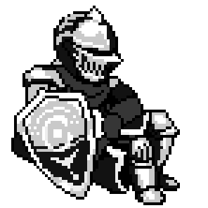

<!-- ============ BANNER ============ -->

  

###

<!-- ============ ANIMATED TITLE (terminal typing) ============ -->

<h1>👋 Hi, I'm Blackholeisoka 🏴</h1>
<h2><samp>Passionate about low-level systems &amp; algorithms</samp></h2>

###
<!-- ============ ABOUT ============ -->
<table align="center">
<tr><td>🎓</td><td>Student at</td><td><b>42 — the peer-to-peer coding school</b></td></tr>
<tr><td>🔥</td><td>What drives me</td><td><b>understanding how things work under the hood</b></td></tr>
<tr><td>🛠️</td><td>I love building</td><td><b>tools from scratch — shells, parsers, low-level stuff</b></td></tr>
<tr><td>🔭</td><td>Currently working on</td><td><b>the 42 cursus — common core</b></td></tr>
<tr><td>🌱</td><td>Currently learning</td><td><b>systems programming & IA</b></td></tr>
<tr><td>💬</td><td>Ask me about</td><td><b>C, low-level & building tools from scratch</b></td></tr>
<tr><td>⚡</td><td>What's next</td><td><b>to be continued...</b></td></tr>
</table>

<!-- ============ GIF (right) ============ -->

<h3 align="left">── Tech Stack 👀</h3>

  
  
  
  
  
  
  
  
  
  
  

<h3 align="left">── Socials 💬</h3>

  
  
  

